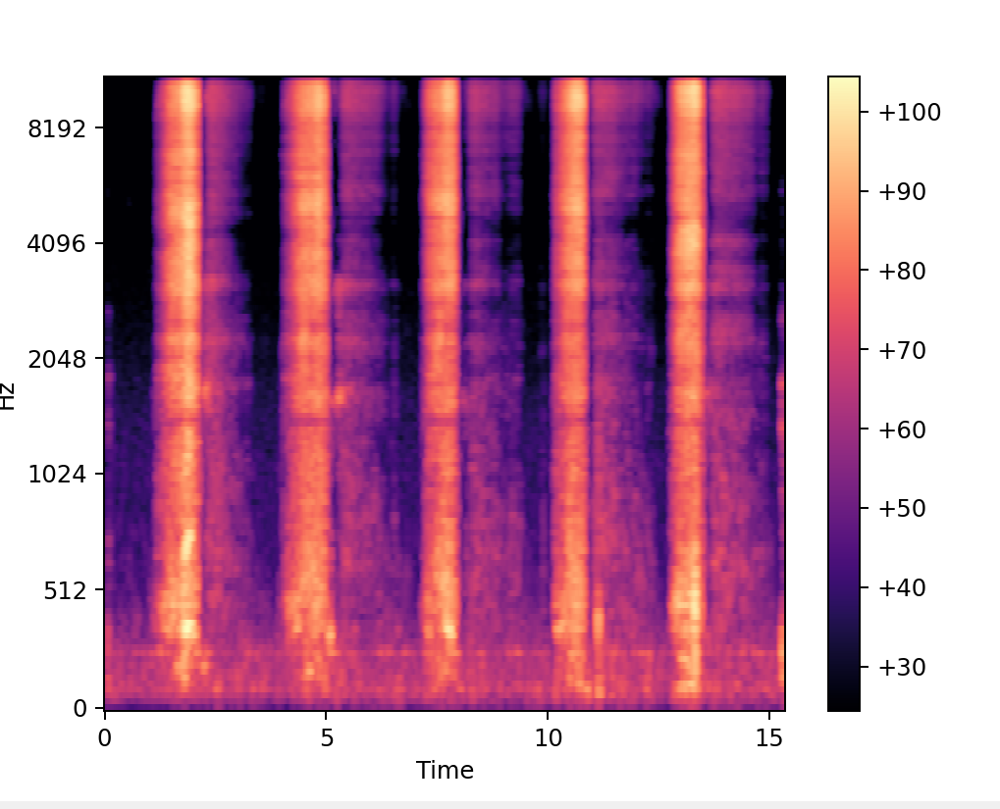

# Auscultatory Sound Analysis using OpenAI and LangChain

### Introduction

This is a chatbot service which leverages OpenAI to try and predict if a person may be infected by COVID-19 or not based on auscultatory (respiratory/breathing) sounds of the subject. This is based on a few research studies which claim that something like this is possible ([ref](https://www.ncbi.nlm.nih.gov/pmc/articles/PMC8513517/)).

## Architecture

This service is leverages the OpenAI tools and the LangChain framework to build a conversational agent (chatbot) which uses a few-shot learning approach on the LLM by leveraging a dataset which contains a bunch of audio files (.wav) with the breathing sounds of patients and the corresponding COVID test status (1 -- they have covid, 0 -- they don't have covid)

### Audio Processor

This is the layer which uses the python library Librosa to read the .wav files, and process the data to generate mel-spectogram data after performing a short-term fourier transform on the audio data and making the length and frequency of the audio data more uniform.

<h4>Sample Mel-Spectogram visualized:</h4>

This melspectogram data is stored a 2-dimensional numpy array of float values.

### Data Processor

This is the layer which processes the dataset, cleans the data, and produces a DataFrame which has a column containing the covid-test-status mapping to the mel-spectogram data of the breathing sounds.

### Agent

This layer has the following tasks:
<ul>
<li>
Load the dataframe coming from the dataprocessor into documents, perform recursive character splitting, and generate embeddings which are stored in a FAISS cache vector store
</li>
<li>
Create a conversational retrieval chain based on the embeddings which takes in a mel spectogram and classifies whether the person would have Covid or not.
</li>
<li>
Create a chatbot agent for answering any regular chat questions.
</li>
<li>
Create an agent which has the above two chains as tools along with a few additional tools for generating mel spectogram out of the input file data.
</li>
</ul>

## How to run the service?
After cloning the repo, initialize a python venv, install all dependencies mentioned in requirements.txt, and run main.py. Interact with the cli interface to ask questions from the bot.

Future goals include wrapping this service around API endpoints, and creating a frontend chatbot app which can be deployed online.

